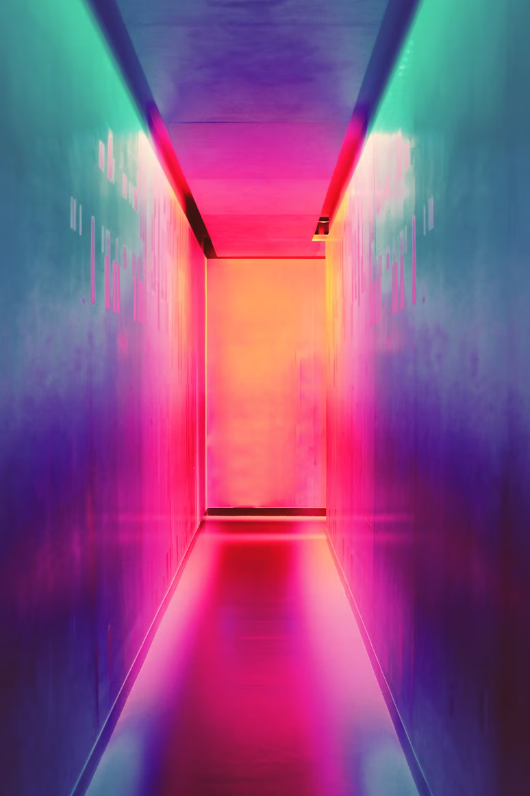

# PNG Image Compression

This project is meant to compress large png images to maximize storage capacity.
This program takes advantage of the .PNG compression system, which encodes each pixel
in reference to how different it is to the surrounding pixels. By rounding pixels to some
arbitrary multiple, we can approximate their value so that little color is lost, but 
the PNG compression is much more optimized.

---

## Results

<table>
  <tr>
    <td>
      
       <em>World Map - 534kBB</em>
    </td>
    <td>
      
       <em>Compressed Map - 203kB</em>
    </td>
  </tr>
</table>
This is an 62.0% compression

<table>
  <tr>
    <td>
      
       <em>World Map - 6.9MB</em>
    </td>
    <td>
      
       <em>Compressed Map - 3.1MB</em>
    </td>
  </tr>
</table>
This is a 55.1% compression.

<table>
  <tr>
    <td>
      
       <em>World Map - 10.9MB</em>
    </td>
    <td>
      
       <em>Compressed Map - 1.7MB</em>
    </td>
  </tr>
</table>

This is an 83.9% compression.

<table>
  <tr>
    <td>
      
       <em>World Map - 58.2MB</em>
    </td>
    <td>
      
       <em>Compressed Map - 11.3MB</em>
    </td>
  </tr>
</table>
This is an 80.6% compression

---

As you can see, some vibrancy and saturation is lost, and images with especially bright colors
might appear washed out. In some cases, gradients will lose their smoothness, but in others, 
such as Hallway.png, they will look just fine. 
Users can specify the rounding multiple to further compress images (default is 10) and decide what amount of
fidelity they want to retain.

